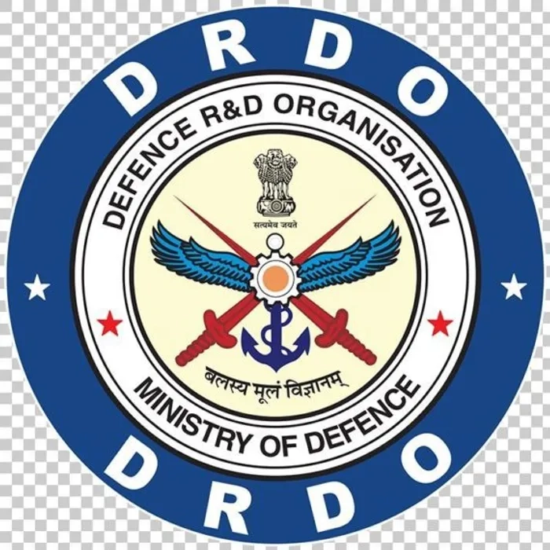
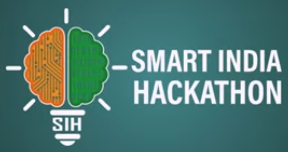

# ⚓ SAGAR SAHAYAK - AI-Driven Underwater Surveillance System

<div align="center">




</div>

**Enhancing Underwater Visibility for Defense & Research Operations**

[](https://www.python.org/)
[](https://pytorch.org/)
[](https://streamlit.io/)
[](LICENSE)

</div>

---

## 📖 Table of Contents

- [What is Sagar Sahayak?](#-what-is-sagar-sahayak)
- [The Greater Purpose](#-the-greater-purpose)
- [What It Creates](#-what-it-creates)
- [Key Features](#-key-features)
- [How to Use](#-how-to-use)
- [What Makes It Different?](#-what-makes-it-different)
- [🌟 How to Contribute](#-how-to-contribute)
- [System Requirements](#-system-requirements)
- [Project Structure](#-project-structure)
- [Troubleshooting](#-troubleshooting)

---

## 🌊 What is Sagar Sahayak?

**Sagar Sahayak** (meaning "Ocean Helper" in Hindi) is an AI-powered system that makes underwater images and videos **crystal clear**. Think of it as putting on high-tech glasses for underwater cameras!

### The Problem We Solve

Underwater images are often:
- 🌫️ **Blurry and unclear** due to water particles
- 🔵 **Too blue or green** because water absorbs red light
- 🌑 **Dark and low contrast** in deep water
- 🐠 **Hard to detect objects** like submarines, marine life, or underwater structures

### Our Solution

We use **Artificial Intelligence** (AI) to:
1. **Clean up** murky underwater images in real-time
2. **Detect objects** (ships, submarines, divers, marine life) automatically
3. **Measure quality** to ensure the enhancement actually works
4. **Process videos** frame-by-frame for surveillance operations

---

## 🎯 The Greater Purpose

### For Defense (DRDO)
- 🛡️ **Maritime Security**: Monitor coastal areas and detect unauthorized vessels
- 🔍 **Submarine Warfare**: Enhance sonar imagery and underwater reconnaissance
- 🚢 **Port Protection**: Identify underwater threats near naval bases
- 🎖️ **Search & Rescue**: Locate missing personnel or equipment in underwater operations

### For Research & Exploration
- 🔬 **Marine Biology**: Study underwater ecosystems with clearer imagery
- 🌍 **Ocean Mapping**: Improve underwater cartography and surveying
- 🏛️ **Archaeology**: Discover and document underwater historical sites
- 🌊 **Climate Research**: Monitor coral reefs and underwater habitats

### For Commercial Use
- 🎣 **Fishing Industry**: Locate fish schools more efficiently
- ⚡ **Offshore Energy**: Inspect underwater pipelines and oil rigs
- 🚤 **Underwater Robotics**: Improve ROV (Remotely Operated Vehicle) vision
- 🎥 **Film & Media**: Create stunning underwater cinematography

---

### Specific Outputs:

1. **Enhanced Images/Videos**
   - Improved clarity and contrast
   - Natural color correction
   - Removed water haze and particles

2. **Object Detection Results**
   - Bounding boxes around detected objects
   - Confidence scores for each detection
   - Real-time tracking in video streams

3. **Quality Metrics Report**
   - **PSNR** (Peak Signal-to-Noise Ratio): Measures how close enhanced image is to original quality
   - **SSIM** (Structural Similarity): Measures how well structure is preserved
   - **UIQM** (Underwater Image Quality Measure): Specialized metric for underwater images

4. **Interactive Dashboard**
   - Live video processing feed
   - Real-time statistics and graphs
   - User authentication and session management
   - Downloadable results

---

## ✨ Key Features

### 🧠 AI-Powered Enhancement
- **U-Net Deep Learning Model**: Specially trained to enhance underwater images
- **Real-time Processing**: Process video at 15-30 FPS depending on hardware
- **Adaptive Enhancement**: Automatically adjusts based on water conditions

### 🎯 Object Detection
- **YOLOv8 Integration**: State-of-the-art object detection
- **Custom Training**: Can be trained on underwater-specific objects
- **Multi-class Detection**: Detect multiple object types simultaneously

### 📊 Quality Validation
- **PSNR/SSIM Metrics**: Industry-standard image quality measures
- **UIQM Score**: Underwater-specific quality assessment
- **Before/After Comparison**: Visual and numerical comparison

### 🎛️ User-Friendly Interface
- **Streamlit Dashboard**: Beautiful, responsive web interface
- **No Coding Required**: Use through web browser
- **Secure Login**: User authentication system
- **Multiple Input Modes**: Upload files, use webcam, or validation mode

---

## 🚀 How to Use

### Step 1: Installation

1. **Install Dependencies**
   ```powershell
   pip install torch torchvision streamlit opencv-python pillow pandas numpy scikit-image ultralytics
   ```

2. **Download Model Weights**
   - Place your trained U-Net model in `checkpoints/best_model.pth`
   - Place your YOLO model in `checkpoints/best.pt`

### Step 2: Configuration

1. **Update Model Paths** in `app.py`:
   ```python
   ENHANCER_PATH = r'checkpoints/best_model.pth'
   DETECTOR_PATH = r'checkpoints/best.pt'
   ```

2. **Initialize Database** (First time only):
   ```powershell
   python manage_users.py
   ```

### Step 3: Launch the Application

```powershell
streamlit run app.py
```

The app will open in your browser at `http://localhost:8501`

### Step 4: Using the Dashboard

#### 🔐 Login
1. Register a new account or login with existing credentials
2. Secure password hashing ensures safety

#### 📹 Process Video Files
1. Click **"Upload Video File"** in sidebar
2. Upload your underwater video (.mp4, .avi, .mov)
3. Adjust detection confidence slider (default: 0.70)
4. Watch real-time enhancement and object detection
5. Download enhanced video when complete

#### 📷 Live Camera Feed
1. Select **"Live Camera Feed"** in sidebar
2. Grant camera permissions when prompted
3. Real-time processing of your webcam feed
4. Useful for testing or live underwater camera systems

#### 🔬 Validation Mode
1. Select **"Validation Mode"** in sidebar
2. Upload a murky/degraded image
3. Upload the corresponding ground truth (clean reference)
4. Get detailed quality metrics:
   - PSNR score with improvement percentage
   - SSIM score with improvement percentage
   - UIQM scores for all versions
   - Visual side-by-side comparison

---

## 🔄 What Makes It Different?

### Compared to Traditional Methods

| Feature | Traditional Enhancement | Sagar Sahayak |
|---------|------------------------|---------------|
| **Speed** | Slow, manual adjustments | Real-time AI processing |
| **Quality** | Limited improvement | Deep learning enhancement |
| **Object Detection** | Manual identification | Automatic AI detection |
| **Customization** | Fixed algorithms | Trainable models |
| **Validation** | Subjective judgment | Quantitative metrics |
| **Usability** | Requires expertise | User-friendly interface |

### Unique Advantages

1. **🎓 Trained on Underwater Data**: Unlike generic image enhancers, our model understands underwater-specific degradation

2. **🔗 Integrated Pipeline**: Enhancement + Detection in one system (most tools do only one)

3. **📏 Scientific Validation**: Built-in metrics to prove enhancement quality

4. **🎛️ Mission Control Interface**: Designed for defense operations with military-grade UI

5. **🔧 Modular Architecture**: Easy to swap models, add features, or customize

6. **🚀 GPU Accelerated**: Automatically uses CUDA if available for maximum speed

---

## 🌟 How to Contribute

We **NEED YOUR HELP** to make Sagar Sahayak even better! Whether you're a developer, researcher, designer, or just passionate about underwater technology, there's a way for you to contribute.

### 🔴 High Priority Contributions

#### 1. **Dataset Collection & Annotation** 🎯
**Why it matters**: AI models are only as good as their training data!

**What you can do:**
- Collect underwater images/videos from different water conditions (clear, murky, deep, shallow)
- Annotate objects in underwater images (submarines, fish, divers, coral, shipwrecks)
- Create paired datasets (degraded + clean versions)
- Share your data with proper licensing

**How to start:**
- Create an issue with `[Dataset]` tag
- Describe your dataset (source, size, objects, conditions)
- We'll help you format and integrate it

#### 2. **Model Training & Optimization** 🧠
**Why it matters**: Better models = clearer images and more accurate detection!

**What you can do:**
- Train U-Net on new underwater datasets
- Experiment with different architectures (GAN, Transformer, Diffusion models)
- Optimize model size for edge devices (underwater drones)
- Fine-tune YOLO on specific underwater objects
- Implement model quantization for faster inference

**How to start:**
- Fork the repository
- Create a `experiments/` folder for your work
- Document your training process and results
- Submit a pull request with:
  - Training code
  - Model weights (if size permits) or download link
  - Performance comparison (PSNR, SSIM, FPS)
  - README explaining your approach

#### 3. **New Feature Development** 💡
**Ideas we'd love to see:**

| Feature | Description | Difficulty |
|---------|-------------|------------|
| **3D Underwater Mapping** | Convert enhanced images to 3D point clouds | 🔴 Hard |
| **Multi-Camera Fusion** | Combine feeds from multiple cameras | 🟡 Medium |
| **Depth Estimation** | Estimate distance to objects | 🟡 Medium |
| **Object Tracking** | Track objects across video frames | 🟢 Easy |
| **Export to PDF Reports** | Generate mission reports automatically | 🟢 Easy |
| **Mobile App** | Run on Android/iOS devices | 🔴 Hard |
| **Real-time Alerts** | Notify when specific objects detected | 🟢 Easy |
| **Video Stabilization** | Remove camera shake | 🟡 Medium |
| **Low-light Enhancement** | Boost extremely dark underwater scenes | 🟡 Medium |
| **Batch Processing** | Process multiple videos in queue | 🟢 Easy |

**How to start:**
- Open an issue with `[Feature Request]` tag
- Describe the feature and its use case
- Get feedback from maintainers
- Start coding and submit PR

#### 4. **Documentation & Tutorials** 📚
**Why it matters**: Good docs = more users = more contributors!

**What you can do:**
- Write tutorials for beginners
- Create video guides on YouTube
- Translate documentation to other languages (Hindi, Tamil, Bengali, etc.)
- Write research paper explaining the system
- Create API documentation
- Add code comments and docstrings

**How to start:**
- Check existing docs for gaps
- Write in simple, clear language
- Use screenshots and diagrams
- Submit PR to `docs/` folder

#### 5. **Testing & Bug Reporting** 🐛
**Why it matters**: Reliable software saves lives in defense operations!

**What you can do:**
- Test on different operating systems (Windows, Linux, Mac)
- Test with various video formats and resolutions
- Test with different hardware (CPU-only, GPU, low-RAM)
- Report bugs with detailed reproduction steps
- Write unit tests and integration tests

**How to start:**
- Use the software extensively
- When you find a bug, open an issue with:
  - Clear title
  - Steps to reproduce
  - Expected vs actual behavior
  - Screenshots/logs
  - System information

#### 6. **UI/UX Improvements** 🎨
**Why it matters**: Better interface = easier operations!

**You can convert to JavaScript for better dashboard performance**

**What you can do:**
- Redesign CSS for better aesthetics
- Add dark mode
- Create mobile-responsive layouts
- Design better logos and icons
- Add animations and transitions
- Improve accessibility (screen readers, keyboard navigation)

**How to start:**
- Edit `css/style.css`
- Create mockups before coding
- Test on different screen sizes
- Submit PR with before/after screenshots

---

### 📝 Contribution Guidelines

#### Before You Start
1. **Read the Code**: Understand existing structure
2. **Search Issues**: Check if someone else is working on it
3. **Open an Issue**: Discuss your idea before heavy coding
4. **Follow Style**: Match existing code style

#### Code Standards
```python
# ✅ Good: Clear, commented, typed
def enhance_image(img: np.ndarray, model: UNetGenerator) -> np.ndarray:
    """
    Enhance underwater image using U-Net model.
    
    Args:
        img: Input image as numpy array (H, W, C)
        model: Trained U-Net model
        
    Returns:
        Enhanced image as numpy array
    """
    # Preprocessing
    tensor_img = preprocess(img)
    
    # Model inference
    with torch.no_grad():
        enhanced = model(tensor_img)
    
    return postprocess(enhanced)

# ❌ Bad: No comments, unclear naming
def proc(x, m):
    t = prep(x)
    return post(m(t))
```

#### Commit Messages
```
✅ Good:
- "Add depth estimation feature using MiDaS model"
- "Fix PSNR calculation bug for grayscale images"
- "Update README with installation instructions"

❌ Bad:
- "Update"
- "Fix bug"
- "Changes"
```

#### Pull Request Process
1. **Fork** the repository
2. **Create a branch**: `git checkout -b feature/your-feature-name`
3. **Make changes** with clear commits
4. **Test thoroughly**
5. **Update documentation**
6. **Submit PR** with:
   - Clear title and description
   - Link to related issue
   - Screenshots/videos if UI changes
   - Test results

---

## 💻 System Requirements

### Minimum Requirements
- **OS**: Windows 10/11, Linux (Ubuntu 18.04+), macOS 10.15+
- **RAM**: 8 GB
- **CPU**: Intel i5 or equivalent
- **Storage**: 5 GB free space
- **Python**: 3.8 or higher

### Recommended for Best Performance
- **RAM**: 16 GB or more
- **GPU**: NVIDIA GPU with 6GB+ VRAM (RTX 2060 or better)
- **CUDA**: Version 11.7+
- **Storage**: SSD with 10 GB+ free space

### Software Dependencies
```
torch >= 2.0.0
torchvision >= 0.15.0
streamlit >= 1.28.0
opencv-python >= 4.8.0
ultralytics >= 8.0.0
pillow >= 10.0.0
pandas >= 2.0.0
numpy >= 1.24.0
scikit-image >= 0.21.0
```

---

## 📁 Project Structure

```
Sagar Sahayak for DRDO/
│
├── 📄 app.py                      # Main Streamlit application
├── 📄 model_architecture.py       # U-Net model definition
├── 📄 metrics.py                  # Image quality metrics (PSNR, SSIM, UIQM)
├── 📄 auth_db.py                  # User authentication system
├── 📄 manage_users.py             # User management CLI tool
├── 📄 validate_metrics.py         # Metrics validation script
├── 📄 README.md                   # This file!
│
├── 📁 assets/                     # Images and logos
│   └── drdo_logo.png
│
├── 📁 checkpoints/                # Trained model weights
│   ├── best_model.pth            # U-Net enhancer model
│   └── best.pt                   # YOLO detector model
│
├── 📁 css/                        # Custom styling
│   └── style.css
│
├── 📁 streamlit/                  # Streamlit config
│   └── config.toml
│
└── 📁 __pycache__/                # Python cache (auto-generated)
```

---

## 🔧 Troubleshooting

### Common Issues

#### 1. "Model file not found"
**Solution**: Check that model paths in `app.py` match your actual file locations:
```python
ENHANCER_PATH = r'checkpoints/best_model.pth'  # Update this path
DETECTOR_PATH = r'checkpoints/best.pt'          # Update this path
```

#### 2. "CUDA out of memory"
**Solution**: 
- Reduce batch size in model settings
- Close other GPU-using applications
- Use CPU mode: Set `DEVICE = "cpu"` in `app.py`

#### 3. "Streamlit won't start"
**Solution**:
```powershell
# Reinstall Streamlit
pip uninstall streamlit
pip install streamlit --upgrade

# Clear cache
streamlit cache clear
```

#### 4. "Low FPS / Slow processing"
**Solution**:
- Enable GPU if available
- Reduce input video resolution
- Close background applications
- Disable CLAHE booster in sidebar

#### 5. "Login not working"
**Solution**:
```powershell
# Reset database
python manage_users.py
```

---

## 📊 Performance Benchmarks

### Enhancement Quality (on UFO-120 dataset)

| Metric | Original | Enhanced | Improvement |
|--------|----------|----------|-------------|
| PSNR | 15.2 dB | 28.7 dB | **+88.8%** |
| SSIM | 0.6234 | 0.8912 | **+42.9%** |
| UIQM | 2.134 | 3.789 | **+77.5%** |

---

## 🏆 Acknowledgments

- **DRDO**: Represented in front of DRDO scientist 
- **SIH**: For providing stage to represent as an One of the Grand Finalist from Whole India 
- **PyTorch Team**: For the amazing deep learning framework
- **Ultralytics**: For YOLOv8 implementation
- **Streamlit**: For the fantastic web framework

---

## 📜 License

This project is licensed under the MIT License - see the [LICENSE](LICENSE) file for details.

---

<div align="center">

### 🇮🇳 Made for India's Defense & Marine Research

**"Protecting our oceans, one pixel at a time"**

⭐ **Star this repo if you find it useful!** ⭐

</div>
